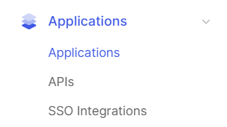
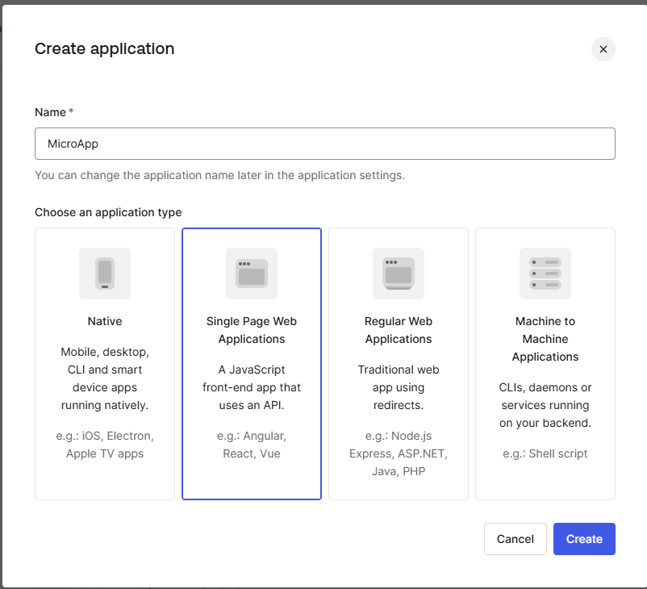

# Microfrontend Project Name

## Overview

This project is part of a microfrontend architecture designed to create a modular and scalable web application. The microfrontends involved in this project include **Auth**, **Dashboard**, **Container**, and **Marketing (Landing Page)**, each responsible for distinct features of the application. The goal is to provide a seamless user experience by integrating these microfrontends into a host application using Webpack Module Federation.

- **Auth Microfrontend**: Handles user authentication, including login and registration.
- **Dashboard Microfrontend**: Displays the dashboard
- **Container Microfrontend**: Serves as the host application that loads and integrates the other microfrontends.
- **Marketing (Landing Page) Microfrontend**: Provides the marketing landing page for the application

### Integration:

Each microfrontend communicates with the host application and the They are dynamically loaded using Webpack Module Federation, allowing for independent development, testing, and deployment of each component.

## Table of Contents

- [Overview](#overview)
- [Architecture](#architecture)
- [Features](#features)
- [Installation](#installation)
- [Usage](#usage)
- [Configuration](#configuration)
- [Testing](#testing)
- [Development](#development)
- [Deployment](#deployment)
- [License](#license)

## Architecture

### General Architecture

This microfrontend setup follows a modular architecture where multiple microfrontends interact with the host application. The microfrontends can be updated independently, which helps scale the system more efficiently.

- **Host Application (Container Microfrontend)**: This is the core application that dynamically loads and integrates other microfrontends.
- **Microfrontend 1 (Auth)**: Handles user authentication processes such as login and registration.
- **Microfrontend 2 (Dashboard)**: Provides the user dashboard
- **Microfrontend 3 (Marketing/Landing Page)**: Displays marketing content,

#### Technologies Used

- **React.js**: For building the user interfaces for all the microfrontends.
- **Webpack Module Federation**: Allows microfrontends to be loaded dynamically and share common dependencies, reducing redundancy.
- **Auth0** : For authentication Service

#### Communication Flow

- The **host application** (Container Microfrontend) uses Webpack Module Federation to load and display the other microfrontends.
- **Auth Microfrontend** handles the login state and shares authentication tokens with other microfrontends.
- **Dashboard Microfrontend** and **Marketing Microfrontend**

## Features

- **Auth Microfrontend**:
  - User login and registration.
- **Dashboard Microfrontend**:
  - Simple user dahboard
- **Container Microfrontend**:
  - Manages the overall layout and routing of the application.
  - Integrates the individual microfrontends into a seamless user experience.
- **Marketing (Landing Page) Microfrontend**:
- Simple Landing page with pricing section

## Installation

### Prerequisites

Ensure that you have the following installed:

- **Node.js** (v16 or higher)
- **npm**

### Steps to Install

1. **Clone the repository**:

   ```bash
   git clone https://github.com/smartdusttechnologies/Trainings.git
   ```

2. **Go to the project directory**

```sh
   cd  Muskan/Microfrontend
```

3.  **Open the terminal**  
    Go to different microfrontend
    1. **Go to Authetication application**

```sh
cd auth
```

```sh
npm install
```

```sh
npm start
```

2.  **Go to COntainer(host) application**

```sh
cd conatainer
```

```sh
npm install
```

```sh
npm start
```

3.  **Go to Marketing application**

```sh
cd marketing
```

```sh
npm install
```

```sh
npm start
```

2.  **Go to Dashboard application**

```sh
cd dashboard
```

```sh
npm install
```

```sh
npm start
```

| Microforntend | Ports                 | Feature                          |
| ------------- | --------------------- | -------------------------------- |
| Auth          | http://localhost:3002 | Handle authentication            |
| Container     | http://localhost:3000 | Integrate all microservices      |
| marketing     | http://localhost:3001 | Handle landing page and other .. |
| dashboard     | http://localhost:3003 | Handle dahboard after login      |

#### How to set up Auth0 in react js or Microfrontend

### 1. **Configuration Steps**

#### **1. Login into Auth0**

- Login to Auth0 via **Google**, **GitHub**, or any other available method.

#### **2. Create an Application in Auth0 Dashboard**

- Go to the [Auth0 Dashboard](https://manage.auth0.com/)
- Navigate to **Applications** > **Applications**
- Click **Create Application**

- **Step 1**: Name your application (e.g., `MicroApp`)

  - Choose **Single Page Web Application**
  - Click **Create**
  - 

- **Step 2**: Configure the application settings:

  - **Allowed Callback URLs**: `http://localhost:3002/callback`, `http://localhost:3000/callback` (or wherever your Auth microfrontend runs)
  - **Allowed Logout URLs**: `http://localhost:3002`, `http://localhost:3000`, `http://localhost:3001`
  - **Allowed Web Origins**: `http://localhost:3002`, `http://localhost:3000`, `http://localhost:3001`
  - Save your **Domain** and **Client ID**

  

#### **3. Wrap Your App with `Auth0Provider`**

- In your `index.js` or `App.js`, wrap your app with `Auth0Provider`.
- Replace `YOUR_DOMAIN` and `YOUR_CLIENT_ID` with your values from the Auth0 dashboard.

```jsx
import { Auth0Provider } from "@auth0/auth0-react";
import React from "react";

export function AuthProvider({ children }) {
  const domain = "YOUR_DOMAIN";
  const clientId = "YOUR_CLIENTID";

  return (
    <Auth0Provider
      domain={domain}
      clientId={clientId}
      authorizationParams={{
        redirect_uri: `${window.location.origin}/callback`,
        audience: "https://localhost:6064",
        scope: "openid profile email read:basket",
      }}
    >
      {children}
    </Auth0Provider>
  );
}
```

4. **Use Auth0 in Application**
   **Login Section**

```jsx
import React from "react";
import { useAuth0 } from "@auth0/auth0-react";
import { Button } from "@mui/material";

const LoginButton = () => {
  const { loginWithRedirect } = useAuth0();

  const handleLogin = async () => {
    await loginWithRedirect();
  };

  return (
    <Button
      onClick={handleLogin}
      sx={{
        color: "white",
        backgroundColor: "transparent",
        border: "none",
        boxShadow: "none",
        "&:hover": {
          backgroundColor: "rgba(255, 255, 255, 0.1)",
        },
      }}
    >
      Log In
    </Button>
  );
};

export default LoginButton;
```

**Profile Section**

```jsx
import React, { useEffect } from "react";
import { useAuth0 } from "@auth0/auth0-react";
import {
  Card,
  CardContent,
  Typography,
  Avatar,
  CircularProgress,
  Box,
} from "@mui/material";
import EmailIcon from "@mui/icons-material/Email";
import PersonIcon from "@mui/icons-material/Person";

const Profile = () => {
  const { user, isAuthenticated, isLoading, getAccessTokenSilently } =
    useAuth0();

  return (
    isAuthenticated && (
      <Box
        display="flex"
        justifyContent="center"
        alignItems="center"
        height="100vh"
        bgcolor="background.default"
        padding={2}
      >
        <Typography
          variant="body1"
          color="textSecondary"
          sx={{ display: "flex", alignItems: "center", marginTop: 1 }}
        >
          <EmailIcon sx={{ marginRight: 1 }} /> {user?.email}
        </Typography>
      </Box>
    )
  );
};

export default Profile;
```

---

1. Overview of Module Federation

# Module Federation Documentation

## Overview

Module Federation is a Webpack feature that allows multiple independent builds (microfrontends) to be shared and loaded on demand, enabling dynamic loading of components between different parts of an application. This provides a scalable way to manage multiple microfrontends in a project, allowing different teams to work independently on separate microfrontends and integrate them seamlessly.

In this project, we use Module Federation to integrate various microfrontends, including **Auth**, **Dashboard**, **Container**, and **Marketing (Landing Page)**, into a single application, making it modular and scalable.

### Key Features

- Dynamic loading of microfrontends.
- Reduced bundle sizes due to shared dependencies.
- Independent deployment and versioning of microfrontends.

## Architecture

### Host Application

The **Host Application** is the container microfrontend responsible for loading and displaying the various microfrontends using Webpack's Module Federation. It is the entry point for the user and dynamically loads other microfrontends (Auth, Dashboard, Marketing).

### Remote Applications (Microfrontends)

Each **Microfrontend** is a separate React application, such as Auth, Dashboard, and Marketing, which is deployed independently. The Host Application uses Webpack's Module Federation to load these microfrontends at runtime.

**Module Federation** allows these microfrontends to:

- Share components and libraries.
- Expose modules to be used by other microfrontends.
- Be updated independently from the Host.

3. Configuration for Module Federation
   Provide clear instructions on how to configure Webpack for Module Federation in both the Host and Remote applications.

Host Application (webpack.config.js)

```jsx
// webpack.config.js for Host Application

module.exports = {
  name: "host",
  remotes: {
    auth: "auth@http://localhost:3002/remoteEntry.js",
    dashboard: "dashboard@http://localhost:3003/remoteEntry.js",
    marketing: "marketing@http://localhost:3001/remoteEntry.js",
  },
};
```

### Remote Application Configuration (e.g., Auth)

Below is an example of the `webpack.config.js` file for a remote application (e.g., Auth):

```jsx
// webpack.config.js for Remote Application (e.g., Auth)

module.exports = {
  name: "auth",
  filename: "remoteEntry.js",
  exposes: {
    "./AuthComponent": "./src/AuthComponent", // Exposes AuthComponent to be used by other apps
    "./AuthApp": "./src/bootstrap.js", // Exposes the main application bootstrap
  },
  shared: {
    react: { singleton: true, eager: true },
    "react-dom": { singleton: true, eager: true },
    "react-router-dom": { singleton: true },
  },
};
```

## Adding a New Microfrontend

Adding a new microfrontend to the project involves creating a new React application, configuring Webpack Module Federation, and integrating it into the Host application. Follow the steps below:

---

### 1. **Create a New Microfrontend**

- **Set up a new React application**:
  Use `create-react-app` or any other boilerplate to create a new React application. For example:

  ```bash
  npx create-react-app new-microfrontend
  cd new-microfrontend
  ```

- **Install webpack Module federation plugin**

```bash
npm install --save-dev @module-federation/webpack
```

- **Configure Webpack in the new Microfrontend**

```jsx
// webpack.config.js for New Microfrontend
const { ModuleFederationPlugin } = require("webpack").container;

module.exports = {
  name: "newMicrofrontend",
  filename: "remoteEntry.js",
  exposes: {
    "./NewComponent": "./src/NewComponent", // Expose NewComponent to be used by other apps
  },
  shared: {
    react: { singleton: true, eager: true },
    "react-dom": { singleton: true, eager: true },
  },
};
```

- **Update the Host Application:**
  - Modify the Host Application's Webpack Configuration: Add the new microfrontend to the remotes section of the Host application's webpack.config.js. Example

```jsx
// webpack.config.js for Host Application
module.exports = {
  remotes: {
    auth: "auth@http://localhost:3002/remoteEntry.js",
    dashboard: "dashboard@http://localhost:3003/remoteEntry.js",
    marketing: "marketing@http://localhost:3001/remoteEntry.js",
    newMicrofrontend: "newMicrofrontend@http://localhost:3004/remoteEntry.js", // Add new microfrontend
  },
};
```

- **Dynamic import the new Microfrontend**

```jsx
import React, { Suspense } from "react";

const NewComponent = React.lazy(() => import("newMicrofrontend/NewComponent"));

const App = () => (
  <Suspense fallback={<div>Loading...</div>}>
    <NewComponent />
  </Suspense>
);

export default App;
```

- **Run and test**

```sh
npm start
```

## Shared Libraries and Dependencies

In **Module Federation**, shared libraries allow microfrontends to reuse common dependencies, ensuring that these libraries are loaded only once. This approach reduces redundancy, optimizes performance, and minimizes the overall bundle size.

### Benefits of Shared Libraries

- **Reduced Bundle Size**: Shared dependencies are loaded only once, avoiding duplication across microfrontends.
- **Improved Performance**: Applications load faster as common libraries are reused.
- **Consistency**: Ensures all microfrontends use the same version of shared libraries.

### Example Configuration

Below is an example of how to configure shared dependencies in the `webpack.config.js` file:

```jsx
shared: {
  react: { singleton: true, eager: true }, // Ensures React is shared as a singleton
  "react-dom": { singleton: true, eager: true }, // Ensures React DOM is shared as a singleton
  "react-router-dom": { singleton: true }, // React Router DOM is shared
}
```

- **singleton: true**: Ensures that only one instance of the library is loaded across all microfrontends.
- **eager**: true: Forces the library to be loaded upfront, avoiding delays during runtime.
- **Library Names**:
- react: The core React library.
- react-dom: The library responsible for rendering React components.
- react-router-dom: Used for routing in React applications.

## Troubleshooting

## Common Issues

### 1. **Module Federation Loading Failures**

- **Problem**: The microfrontend's `remoteEntry.js` file is not accessible from the Host application.
- **Solution**:
  - Ensure that the `remoteEntry.js` file is being served correctly by the remote application.
  - Verify that the `publicPath` in the remote application's Webpack configuration is set correctly.
  - Check the network requests in the browser's developer tools to confirm that the `remoteEntry.js` file is being loaded without errors.
  - Ensure the `remoteEntry.js` URL in the Host application's Webpack configuration matches the actual URL where the file is hosted.

---

### 2. **Version Mismatch**

- **Problem**: Shared libraries (e.g., React, React DOM) have version conflicts between the Host and Remote applications.
- **Solution**:
  - Ensure all microfrontends use the same version of shared libraries in their `package.json` files.
  - Use the `shared` configuration in Webpack to enforce singleton instances of shared libraries.
  - Example:
    ```javascript
    shared: {
      react: { singleton: true, requiredVersion: "17.0.2" },
      "react-dom": { singleton: true, requiredVersion: "17.0.2" },
    }
    ```
  - Run `npm ls react` and `npm ls react-dom` in each microfrontend to verify the installed versions.

---

### 3. **404 Errors for Remote Modules**

- **Problem**: The Host application cannot find the remote module, resulting in a 404 error.
- **Solution**:
  - Verify that the `remoteEntry.js` file is being served at the correct URL.
  - Check the `remotes` configuration in the Host application's Webpack configuration to ensure the URL is correct.
  - Example:
    ```javascript
    remotes: {
      remoteApp: "remoteApp@http://localhost:3001/remoteEntry.js",
    }
    ```

---

### 4. **Remote Application Not Starting**

- **Problem**: The remote application fails to start due to Webpack configuration errors.
- **Solution**:

  - Check the `entry` and `output` configurations in the remote application's Webpack configuration.
  - Ensure the `ModuleFederationPlugin` is correctly configured with the `name`, `filename`, and `exposes` options.
  - Example:

    ```javascript
    const { ModuleFederationPlugin } = require("webpack").container;

    module.exports = {
      plugins: [
        new ModuleFederationPlugin({
          name: "remoteApp",
          filename: "remoteEntry.js",
          exposes: {
            "./MyComponent": "./src/MyComponent",
          },
        }),
      ],
    };
    ```

---

### 5. **Shared Dependencies Not Compatible**

- **Problem**: Shared dependencies cause runtime errors due to incompatible versions.
- **Solution**:
  - Use the `singleton` option in the `shared` configuration to enforce a single instance of the library.
  - Example:
    ```javascript
    shared: {
      react: { singleton: true, eager: true },
      "react-dom": { singleton: true, eager: true },
    }
    ```

---

### 6. **Remote Container Not Found**

- **Problem**: The Host application cannot find the remote container.
- **Solution**:
  - Verify that the `name` in the remote application's Webpack configuration matches the name used in the Host application's `remotes` configuration.
  - Ensure the remote application is running and accessible at the specified URL.

---

### 7. **CSS Not Loaded in the Host Application**

- **Problem**: Styles from the remote application are not applied in the Host application.
- **Solution**:
  - Use a CSS loader like `style-loader` or `mini-css-extract-plugin` in both the Host and Remote applications.
  - Example:
    ```javascript
    {
      test: /\.css$/,
      use: ["style-loader", "css-loader"],
    }
    ```

---

### 8. **TailwindCSS or CSS Conflicts**

- **Problem**: Conflicting styles between the Host and Remote applications (e.g., different versions of Bootstrap or TailwindCSS).
- **Solution**:

  - Use **CSS Modules** to scope styles locally to components.

    - Example:

      ```css
      /* Button.module.css */
      .button {
        background-color: #007bff;
        color: white;
        padding: 10px;
        border: none;
        border-radius: 4px;
      }
      ```

      ```javascript
      import styles from "./Button.module.css";

      const Button = () => <button className={styles.button}>Click Me</button>;
      ```

  - For Material-UI, use `createGenerateClassName` to add unique prefixes to class names:

    ```javascript
    import { StylesProvider, createGenerateClassName } from "@mui/styles";

    const generateClassName = createGenerateClassName({
      productionPrefix: "app1-", // Unique prefix for each app
    });

    function App() {
      return (
        <StylesProvider generateClassName={generateClassName}>
          {/* Your components */}
        </StylesProvider>
      );
    }
    ```

---

### 9. **Fonts and Images Not Displaying**

- **Problem**: Fonts or images are not bundled correctly or paths are broken when loading from a remote.
- **Solution**:
  - Add a Webpack rule to handle assets:
    ```javascript
    {
      test: /\.(png|woff|woff2|eot|ttf|svg)$/,
      type: "asset/resource",
    }
    ```

---
