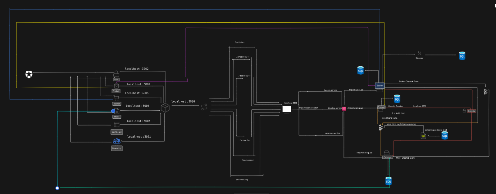
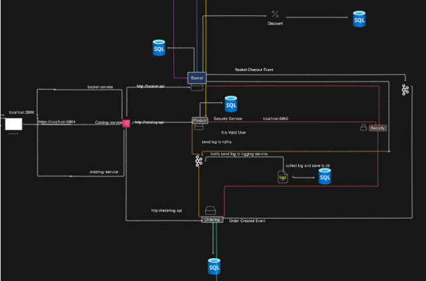
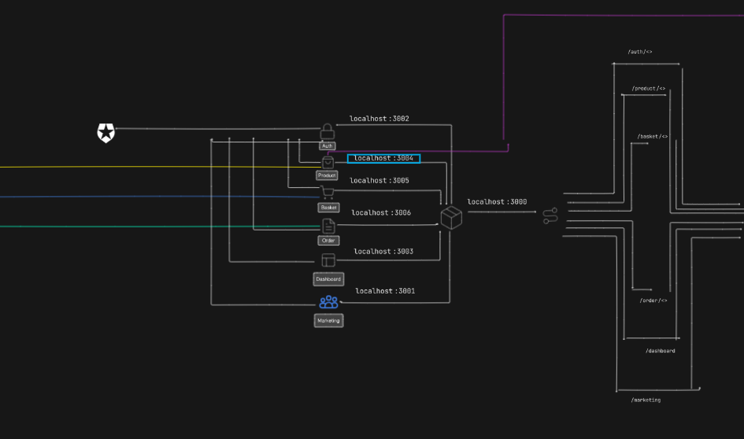

# Microservices and Microforntend Architecture

## Overview

### Microservice & Microfronted Architecture



## Introduction

This project follows a **Microservices Architecture**, where each service is independently developed, deployed, and managed. Below is a detailed explanation of each microservice, its responsibilities, technologies used, and API endpoints.

## Tech Stack

- **Backend:** ASP.NET Core
- **Frontend:** ASP.NET Core Razor Page
- **Database:** SQL Server, PostgreSQL, Redis
- **Pattern and Principles:**
  - **Architecture:** Vertical Slice Architecture, Clean Architecture
  - **Message Broker:** RabbitMQ
  - **Containerization:** Docker
  - **API Gateway:** YARP

# Microservices

## Overview

### Microservice Architecture



## Catalog Service (Product Service)

### Description:

- Manages Product Addition, deletion, updates, retrieval by ID, and category , retrieval with pagination.

### Technology Stack:

- **Database:** Sql Server
- **Libraries:**
  - Entity Framework Core
  - Carter (for Minimal API endpoint definition)
- **Architecture:** Vertical Slice Architecture
- **Pattern and Principles:** CQRS, Pipeline Behavior with FluentValidation

### Key Features:

- Product Addition
- Deletion
- Update
- Get with pagination (PageIndex and PageSize)
- Get Product by ID
- Get Product by Category
- Health Check

### API Endpoints:

```http
GET /products?pageNumber=1&pageSize=5       # Get with pagination
GET /health                                 # Health check
GET /products/category/Fruits               # Get by Category
GET /products/{id}                          # Get Product by ID
POST /products                              # Insert a Product
PUT /products                               # Update Product
DELETE /products/{id}                       # Delete Product
```

## Order Service

### Description:

Processes customer orders and manages order history.

### Technology Stack:

- **Database:** SQL Server
- **Architecture:** Clean Architecture, Domain Driven Design

### Key Features:

- Order Addition
- Deletion
- Update
- Get with pagination (PageIndex and PageSize)
- Get Product by Name
- Get Product by CustomerId
- Health Check

### API Endpoints:

```http
GET /orders?pageNumber=1&pageSize=5         # Get with pagination
GET /health                                 # Health check
GET /order/customer/{customerID}            # Get by CustomerId
GET /order/{Ordername}                      # Get Basket by Ordername
POST /order                                 # Store Order
PUT /order                                  # Update Order
DELETE /order/{id}                          # Delete Order
```

## Discount Management

### Description :

ASP.NET Grpc Server application
Build a Highly Performant inter-service gRPC Communication with Basket Microservice
Exposing Grpc Services with creating Protobuf messages

### Technology Stack:

- **Database:** SQLite
- **Libraries:**
  - Entity Framework Core
  - Carter (for Minimal API endpoint definition)

### Key Features:

- Discount Addition
- Deletion
- Update
- Get by ProductName

### API Endpoints:

```http
GET /discount/{Productname}                   # Get Discount by Productname
POST /discount                                # Add Discount
POST /discount/checkout                       # Discount CheckOut
PUT /discount                                 # Update Discount
DELETE /discount/{id}                         # Delete Discount
```

## Basket Service

### Description:

Manages basket addition, deletion, updates, retrieval by ID, and Custommer retrieval by Pagination .

### Technology Stack:

- **Database:** Sql Server
- **Libraries:**
  - Entity Framework Core
  - Carter (for Minimal API endpoint definition)
- **Architecture:** Vertical Slice Architecture
- **Pattern and Principles:** CQRS, Pipeline Behavior with FluentValidation

### Key Features:

- Basket Addition
- Deletion
- Update
- Get with pagination (PageIndex and PageSize)
- Get Product by Name
- Get Product by Customer
- Health Check
- Connect with discount services using grpc

### API Endpoints:

```http
GET /basket?pageNumber=1&pageSize=5         # Get with pagination
GET /health                                 # Health check
GET /basket/customer/{id}                   # Get by CustomerId
GET /basket/{name}                          # Get Basket by Name
POST /basket                                # Store basket
POST /basket/checkout                       # Basket CheckOut
PUT /basket                                 # Update Basket
DELETE /basket/{id}                         # Delete Basket
```

## Microservices Communication

| Service          | Communication   | Technology       |
| ---------------- | --------------- | ---------------- |
| Product Service  | REST API        | HTTP             |
| Order Service    | Event-Driven    | RabbitMQ         |
| Basket Service   | REST API + gRPC | HTTP + gRPC      |
| Discount Service | Grpc            | Protocol Buffers |

## 🛠️ How to Run the Microservices?

### Prerequisites

Ensure you have the following installed on your system before proceeding:

- **Git** - [Download Git](https://git-scm.com/downloads)
- **Visual Studio 2022** (with .NET Core Workloads) - [Download Visual Studio](https://visualstudio.microsoft.com/)
- **Docker Desktop** - [Download Docker](https://www.docker.com/products/docker-desktop/)
- **SQL Server** (if using SQL-based databases) - [Download SQL Server](https://www.microsoft.com/en-us/sql-server/sql-server-downloads)
- **SSMS (SQL Server Management Studio)** - [Download SSMS](https://aka.ms/ssmsfullsetup)

---

### Clone the Repository:

```sh
git clone https://github.com/smartdusttechnologies/Trainings.git
cd Muskan/Microservices2
```

### Change the Connection String of All Microservices

#### **For Basket Service**

```json
"ConnectionStrings": {
"SqlServerDb": "Server=YOUR_SERVER;Database=BasketDb;User Id=YOUR_ID;Password=YOUR_PASSWORD;TrustServerCertificate=True",
"Redis": "localhost:6379"
}
```

#### **For Catalog Service**

```json
"ConnectionStrings": {
  "SqlServerDb": "Server=YOUR_SERVER;Database=CatalogDb;User Id=YOUR_ID;Password=YOUR_PASSWORD;TrustServerCertificate=True"
}
```

#### **For Order Service**

```json
"ConnectionStrings": {
  "SqlServerDb": "Server=YOUR_SERVER;Database=OrderDb;User Id=YOUR_ID;Password=YOUR_PASSWORD;TrustServerCertificate=True"
}
```

#### **For Logging Service**

```json
"ConnectionStrings": {
  "SqlServerDb": "Server=YOUR_SERVER;Database=OrderDb;User Id=YOUR_ID;Password=YOUR_PASSWORD;TrustServerCertificate=True"
}
```

---

### Database Migration (If Necessary)

Note:_ Migration is already run. Simply running the app will automatically update the database by checking if it exists. However, if needed, run the following commands:_

#### **For Basket Service**

Navigate to each services

```sh
cd Microservices2/Basket/src
```

```sh
Add-Migration Initial -StartupProject Basket.API
```

#### **For Catalog Service**

```sh
cd Microservices2/Product/src
```

```sh
Add-Migration Initial -StartupProject Catalog.API
```

#### **For Order Service**

```sh
cd Microservices2/Order/src
```

```sh
Add-Migration Initial -StartupProject Ordering.API -Project Ordering.Infrastructure -OutDir Data/Migrations
```

```sh
cd Microservices2/Logging/src/Logging.API
```

```sh
Add-Migration Initial -StartupProject Logging.API
```

---

### Running the Microservices

#### Run Docker Containers for the First Time (Visual Studio)

- Open Visual Studio.

- In the Startup Project dropdown, select Docker-compose.

- Run the application.

- Check it locally in Visual Studio.

#### Run Docker Containers:

Ensure Docker Desktop is running, then execute the following command:

Go to each Microservices Solution folder for each

```sh
docker-compose up -d
```

In root project Microservices2
there is common images of database, messagebroker etc .,

```sh
docker-compose docker-compose.common.yml up -d
```

Alternative
Locate DockerComposeBat.bat.

Double-click to execute the script.

---

#### Access API Gateway:

Once the application is running, you can access the API Gateway at:

```
https://localhost:6065/
```

# MicroFrontend

## Overview

### MicroFrontend Architecture



## Introduction

- This project is part of a microfrontend architecture designed to create a modular and scalable web application. The microfrontends involved in this project include **Auth**, **Dashboard**, **Container**, and **Marketing (Landing Page)**, each responsible for distinct features of the application. The goal is to provide a seamless user experience by integrating these microfrontends into a host application using Webpack Module Federation.

- **Auth Microfrontend**: Handles user authentication, including login and registration.
- **Dashboard Microfrontend**: Displays the dashboard
- **Container Microfrontend**: Serves as the host application that loads and integrates the other microfrontends.
- **Marketing (Landing Page) Microfrontend**: Provides the marketing landing page for the application
- **Product Microfrontend**: Display product list and details
- **Basket Microfrontend**: Display product list and details Display basket or cart and checkout the order
- **Order Microfrontend**: Display the list of Order with the customer Id

## Steps to Install

### **Clone the repository**:

```bash
git clone https://github.com/smartdusttechnologies/Trainings.git
```

### **Go to the project directory**

```sh
   cd  Muskan/Microservices_Microfrontend_Kafka/Microfrontend
```

### **Using Docker Desktop**

```sh
docker-compose up -d
```

### Running in Local

#### Go to different microfrontend

##### Authetication

```sh
cd auth
```

```sh
npm install
```

```sh
npm start
```

##### Container(host)

```sh
cd conatainer
```

```sh
npm install
```

```sh
npm start
```

##### Marketing

```sh
cd marketing
```

```sh
npm install
```

```sh
npm start
```

##### Dashboard

```sh
cd dashboard
```

```sh
npm install
```

```sh
npm start
```

##### Product

```sh
cd product
```

```sh
npm install
```

```sh
npm start
```

##### Basket

```sh
cd basket
```

```sh
npm install
```

```sh
npm start
```

##### Ordering application

```sh
cd order
```

```sh
npm install
```

```sh
npm start
```

| Microforntend | Ports                 | Feature                          |
| ------------- | --------------------- | -------------------------------- |
| Auth          | http://localhost:3002 | Handle authentication            |
| Container     | http://localhost:3000 | Integrate all microservices      |
| marketing     | http://localhost:3001 | Handle landing page and other .. |
| Dashboard     | http://localhost:3003 | Handle dahboard after login      |
| Product       | http://localhost:3004 | Handle Product                   |
| Basket        | http://localhost:3005 | Handle Basket after login        |
| Order         | http://localhost:3006 | Handle Order after login         |

# Setup both Microfrontend and Microservice

## Go to the root directory

```sh
cd to/your/path/Training/Muskan/Microservices_Microfrontend_Kafka
```

## Run the command

- And run the following command in terminal

```sh
docker-compose up -d
```

## Check in the UI

- After this check whether the app services running or not
- localhost:3000 and test the app
- in your chrome or edge

## Check in the Postman

| Category              | Service                 | Ports                  | Feature                          |
| --------------------- | ----------------------- | ---------------------- | -------------------------------- |
| Microfrontend         | Container               | http://localhost:3000  | Integrate all microservices      |
|                       | marketing               | http://localhost:3001  | Handle landing page and other .. |
|                       | Auth                    | http://localhost:3002  | Handle authentication            |
|                       | Dashboard               | http://localhost:3003  | Handle dahboard after login      |
|                       | Product                 | http://localhost:3004  | Handle Product                   |
|                       | Basket                  | http://localhost:3005  | Handle Basket after login        |
|                       | Order                   | http://localhost:3006  | Handle Order after login         |
|                       |                         |                        |                                  |
| Microservices(Docker) | catalog.api (8081)      | https://localhost:6060 | Product Service                  |
|                       | basket.api (8081)       | https://localhost:6061 | Basket Service                   |
|                       | discount.grpc (8081)    | https://localhost:6062 | Discount Service                 |
|                       | ordering.api (8081)     | https://localhost:6063 | Ordering Services                |
|                       | ocelotapigateway (8081) | https://localhost:6064 | Api Gateaway for the backend     |
|                       | security (8081)         | https://localhost:6066 | Common Security service          |
|                       | logging.api (8081)      | https://localhost:6067 | Common Logging Service           |
|                       |                         |                        |                                  |
| Microservices (Local) | Catalog                 | https://localhost:5050 | Product Service                  |
|                       | Bakset                  | https://localhost:5051 | Basket Service                   |
|                       | Discount                | https://localhost:5052 | Discount Service                 |
|                       | Ordering                | https://localhost:5053 | Ordering Services                |
|                       | ocelotapigateway        | https://localhost:5054 | Api Gateaway for the backend     |
|                       | security                | https://localhost:5056 | Common Security service          |
|                       | logging                 | https://localhost:5057 | Common Logging Service           |
|                       |                         |                        |                                  |
| Infrastructure        | RabbitMq                | http://localhost:15672 | Message broker (Mgmt UI)         |
|                       | Kafka                   | http://localhost:9092  | Kafka broker (external)          |
|                       | Zookeeper               | http://localhost:2181  | Zookeeper service for Kafka      |
|                       | Sql database            | http://localhost:1433  | Database                         |
|                       | Redis                   | http://localhost:6379  | In memory Database               |
|                       |                         |                        |                                  |
